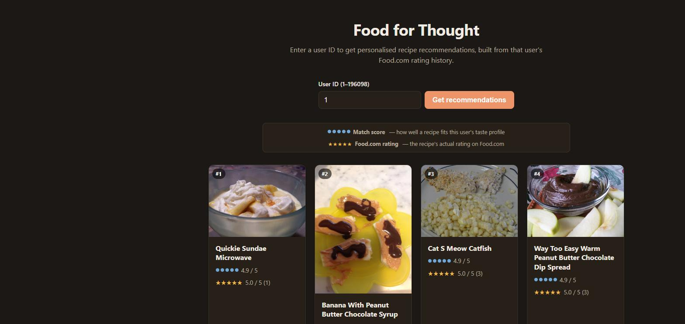
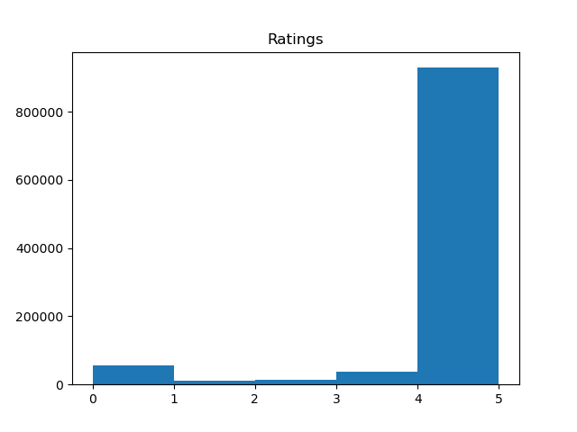
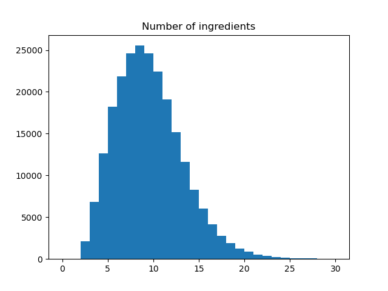

# food-for-thought

A recipe recommender built on the [Food.com Recipes and Interactions](https://www.kaggle.com/datasets/shuyangli94/food-com-recipes-and-user-interactions)
dataset. Give it a Food.com user ID, and it looks at that user's past recipe
ratings, works out which ingredients and tags they tend to rate highly, and
returns a personalised top-10 list of recipes they haven't rated yet.

**Live demo:** https://food-for-thought-b8ur.onrender.com/ (free-tier Render
instance — the first request after a period of inactivity can take 30-60s to
wake the server up).



## The dataset

[Food.com Recipes and Interactions](https://www.kaggle.com/datasets/shuyangli94/food-com-recipes-and-user-interactions)
(Majumder, Li, Ni & McAuley, EMNLP 2019) — ~180k recipes and ~700k reviews
scraped from Food.com. This project uses cleaned/reprocessed versions of the
recipe and interaction tables (see `preprocessing/` and Repo layout below),
committed directly in `data/`.

## How it works

This uses a simple content-based approach:

1. **`parseReviews`** (`app.py`) looks at everything a user has rated, and for
   every ingredient and tag that appears in those recipes, computes a running
   average of the ratings the user gave recipes containing it. This produces
   two vectors — "how much this user tends to like each ingredient" and
   "... each tag" — based only on their own rating history.
2. **`vectorizeRecipes`** (`recipe_vectors.py`, precomputed offline by
   `build_recipe_vectors.py`) builds sparse ingredient x recipe and tag x
   recipe matrices marking which ingredients/tags appear in which recipe,
   across all ~232k recipes.
3. **`generateRecommendations`** (`app.py`) dot-products the user's
   preference vectors against every recipe's ingredient/tag matrix, divides
   by ingredient/tag count per recipe (so recipes with long ingredient lists
   don't win purely on volume), averages the ingredient-score and tag-score,
   and returns the top recipes the user hasn't already rated.

Recipe images and Food.com's own star rating aren't in the dataset, so
`app.py` scrapes each recommended recipe's Food.com page on first request
(`og:image` meta tag + the `aggregateRating` in its JSON-LD block) and caches
the result in memory, since the same recipes tend to get recommended to many
users.

## Repo layout

- **`app.py`** — the Flask app: loads the processed data files at import,
  exposes `/` (the frontend) and `/process` (POST, returns JSON
  recommendations for a user ID).
- **`recipe_vectors.py`** — loads the raw data files and builds the sparse
  recipe vectors described above.
- **`build_recipe_vectors.py`** — offline script that runs `vectorizeRecipes`
  once and pickles the result to `data/recipes_vectors.pkl`, so `app.py`
  doesn't have to redo that work (and the ~30s+ startup that came with it) on
  every deploy/restart.
- **`templates/`, `static/`** — the frontend: a Jinja template plus
  vanilla CSS/JS that posts to `/process` and renders results as a card grid.
- **`data/`** — the processed CSV/JSON/pickle files the app loads at
  startup (see Known limitations for why these are committed rather than
  regenerated).
- **`preprocessing/tags_preprocessing.ipynb`** — notebook that cleans up the
  recipe tag vocabulary; one of the inputs to `data/recipes_improved.csv`.
- **`graphs/`** — the exploratory data analysis notebook (`Initial
  graphs.ipynb`) and its exported charts, a couple of which are below.
- **`tests/`** — pytest suite covering `parseReviews` and
  `generateRecommendations` against small synthetic data.
- **`.github/workflows/ci.yml`** — lint (`ruff`) + test (`pytest`) on every
  push/PR to `main`.

## Local setup

```bash
git clone https://github.com/ethkatzy/food-for-thought.git
cd food-for-thought
python -m venv .venv
source .venv/bin/activate   # Windows: .venv\Scripts\activate
pip install -r requirements.txt
python app.py
```

Then open http://localhost:5002. The data files needed to run it
(`data/interactions_processed.csv`, `data/recipes_improved.csv`,
`data/recipes_processed_key.json`, `data/recipes_vectors.pkl`) are already
committed, so no separate download/build step is required.

## What we found in EDA

A couple of charts from `graphs/Initial graphs.ipynb` that shaped the model:



Ratings are heavily skewed toward 5 stars — most users only rate things they
already decided to cook, so a plain average-rating signal is close to
useless on its own. This is part of why the recommender scores recipes by
*relative* per-ingredient/tag preference within a user's own history, rather
than by raw rating.



Most recipes have somewhere between 5 and 15 ingredients, which is why
`generateRecommendations` normalizes each recipe's score by its ingredient
(and tag) count — otherwise recipes with unusually long ingredient lists
would systematically score higher regardless of fit.


## License

The code in this repo is MIT licensed (see `LICENSE`). That covers `app.py`,
`recipe_vectors.py`, and the rest of the application/notebook code — not the
Food.com dataset in `data/`, which is redistributed here under its own
Kaggle dataset terms.

## Known limitations

- **Cold start** — a user with no rating history gets all-zero preference
  vectors, so recommendations degrade to an arbitrary tie-broken ordering
  rather than anything personalised.
- **Static dataset** — this is a fixed historical snapshot of Food.com data,
  not a live feed; no recipes or ratings newer than the dataset exist.
- **Live scraping for images/ratings** — recipe images and Food.com's own
  star rating are fetched from Food.com's live site per request (then
  cached in memory), so they depend on Food.com's page structure and
  availability rather than being part of the dataset itself.
- **Free-tier hosting** — the Render deployment spins down after
  inactivity, so the first request after idling has a 30-60s cold start.
